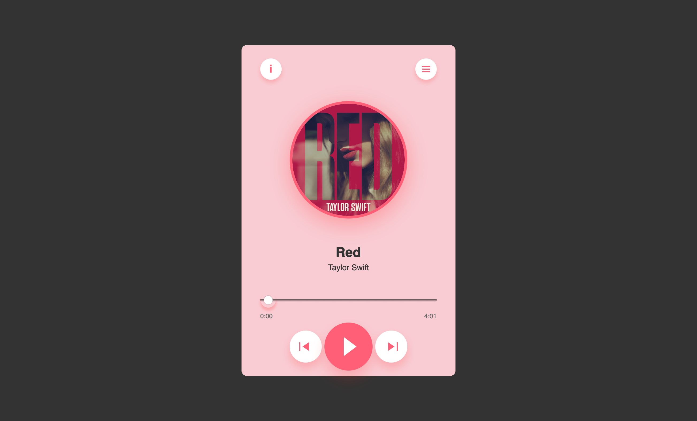
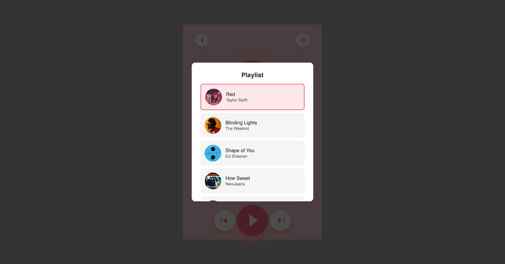
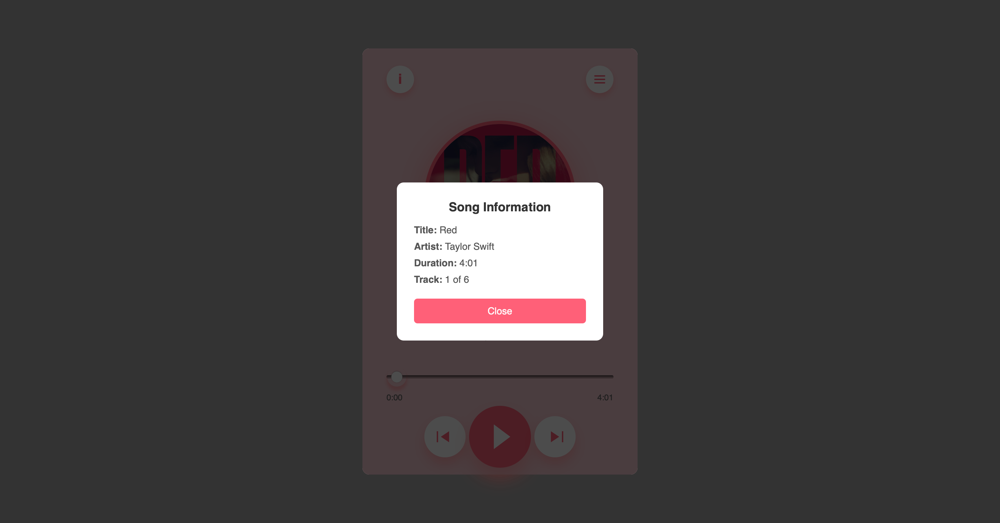
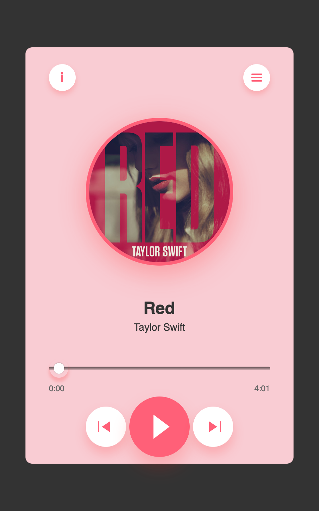

# React Music Player 🎵

A beautiful, responsive music player built with React and TypeScript featuring a modern pink-themed UI with smooth animations and intuitive controls.

## 🌟 Features

- **Clean Modern Design**: Beautiful pink-themed interface with glassmorphism effects
- **Rotating Album Art**: Album covers rotate when music is playing
- **Interactive Progress Bar**: Click to seek to any position in the track
- **Playlist Management**: Browse and select songs from a visual playlist
- **Song Information Modal**: View detailed information about the current track
- **Responsive Controls**: Previous, play/pause, and next buttons with hover effects
- **Auto-Play Next**: Automatically plays the next song when current song ends
- **Time Display**: Shows current time and total duration
- **TypeScript Support**: Fully typed for better development experience

## 📸 Screenshots

### Main Player Interface

*The main music player interface with rotating album art and control buttons*

### Playlist Modal

*Interactive playlist showing all available songs with thumbnails*

### Song Information Modal

*Detailed song information including title, artist, duration, and track number*

### Mobile Responsive View

*Fully responsive design that works perfectly on mobile devices*

## 🚀 Live Demo

**[View Live Site](https://rllz0.github.io/music-player-ts/)**

Try out the music player with the included sample tracks from popular artists like Taylor Swift, The Weeknd, Ed Sheeran, and more!

## 🛠️ Technologies Used

- **React 18** - Modern React with hooks
- **TypeScript** - Type-safe development
- **CSS3** - Custom animations and modern styling
- **Vite** - Fast build tool and development server

## 📁 Project Structure

```
src/
├── components/           # Reusable React components
│   ├── AudioElement.tsx     # Audio HTML element wrapper
│   ├── Navigation.tsx       # Top navigation with info and playlist buttons
│   ├── PlayerControls.tsx   # Play, pause, previous, next controls
│   ├── PlaylistModal.tsx    # Playlist selection modal
│   ├── ProgressBar.tsx      # Progress bar and time display
│   ├── SongDisplay.tsx      # Album art and song title display
│   └── SongInfoModal.tsx    # Song information modal
├── assets/
│   ├── images/          # Album cover images
│   └── songs/           # Audio files
├── data.ts              # Song data and imports
├── types.ts             # TypeScript type definitions
├── MusicPlayer.tsx      # Main player component
├── MusicPlayer.css      # Styling
└── main.tsx            # Application entry point
```

## 🎵 Included Tracks

The player comes with sample tracks from:

1. **Red** - Taylor Swift
2. **Blinding Lights** - The Weeknd
3. **Shape of You** - Ed Sheeran
4. **How Sweet** - NewJeans
5. **Toxic Till The End** - ROSE
6. **Baby** - Justin Bieber

## 🚀 Getting Started

### Prerequisites

- Node.js (version 16 or higher)
- npm or yarn

### Installation

1. **Clone the repository**
   ```bash
   git clone https://github.com/yourusername/react-music-player.git
   cd react-music-player
   ```

2. **Install dependencies**
   ```bash
   npm install
   # or
   yarn install
   ```

3. **Start the development server**
   ```bash
   npm run dev
   # or
   yarn dev
   ```

4. **Open your browser**
   
   Navigate to `http://localhost:5173` to see the music player in action!

### Building for Production

```bash
npm run build
# or
yarn build
```

The built files will be in the `dist` directory, ready for deployment.

## 🎨 Customization

### Adding New Songs

1. Add your audio files to `src/assets/songs/`
2. Add album cover images to `src/assets/images/`
3. Update the `data.ts` file with your new songs:

```typescript
import YourSong from './assets/songs/your-song.mp3';
import YourImage from './assets/images/your-image.jpg';

export const songs = [
  // ... existing songs
  {
    id: 7,
    title: "Your Song Title",
    artist: "Your Artist",
    thumbnail: YourImage,
    audioUrl: YourSong
  }
];
```

### Styling

The player uses CSS custom properties for easy theming. Main color variables:

```css
:root {
  --primary-color: #ff6078;
  --background-color: #f9ccd3;
  --text-color: #333;
}
```

## 🤝 Contributing

Contributions are welcome! Please feel free to submit a Pull Request. For major changes, please open an issue first to discuss what you would like to change.

1. Fork the project
2. Create your feature branch (`git checkout -b feature/AmazingFeature`)
3. Commit your changes (`git commit -m 'Add some AmazingFeature'`)
4. Push to the branch (`git push origin feature/AmazingFeature`)
5. Open a Pull Request


## 🙏 Acknowledgments

- Album cover images and audio files are used for demonstration purposes
- Inspired by modern music player designs

---

**Enjoy your music! 🎶**